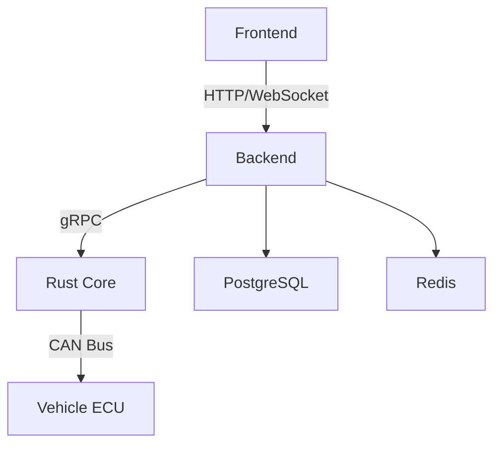

# System Architecture

## Key Components
1. **Electron UI** - Desktop application interface
2. **Node.js Backend** - Business logic and API layer
3. **Rust Core** - High-performance CAN bus communication
4. **PostgreSQL** - Primary data storage
5. **Redis** - Real-time caching and pub/sub

## Data Flow
1. User actions in UI trigger API calls
2. Backend processes requests and communicates with Rust Core
3. Rust Core handles low-level vehicle communication
4. Data persisted to PostgreSQL, cached in Redis
