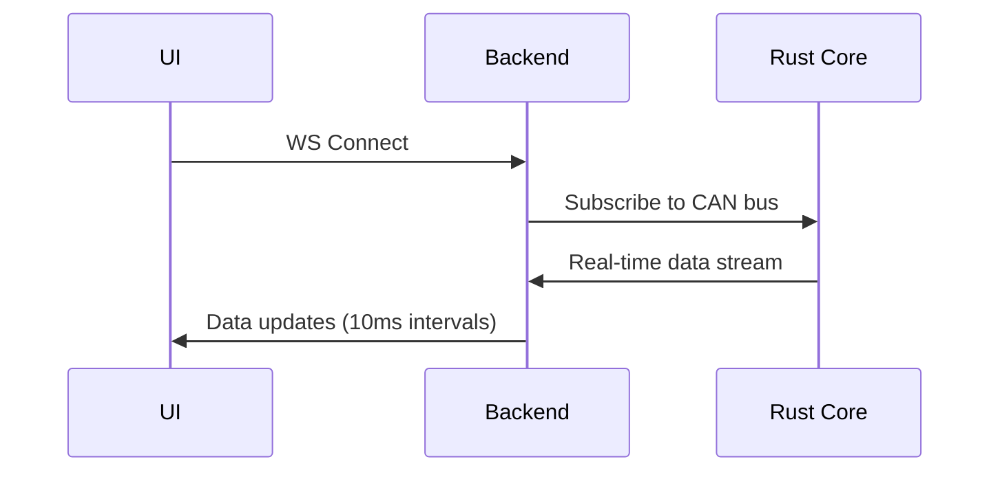

# Backend Architecture

## API Endpoints
`GET /api/vehicle/status` - Current vehicle status
`POST /api/tuning/flash` - Flash new ECU tune
`WS /ws/real-time` - Real-time telemetry stream

## WebSocket Channels


## Thought Packet Schema
```ts
interface ThoughtPacket {
  id: string;
  timestamp: number;
  content: string;
  emotionalState: {
    valence: number; // -1 to 1
    arousal: number; // -1 to 1
    dominance: number; // -1 to 1
  };
  source: 'user' | 'system';
}
```
