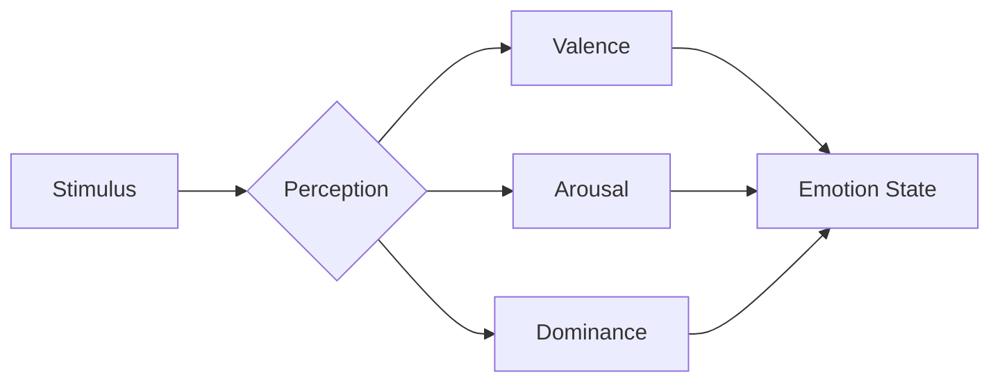

# Emotional Engine Specification

## PAD Model


## Emotional State Calculation
```python
def calculate_emotion(valence, arousal, dominance):
    # Normalize values between -1 and 1
    v = max(-1, min(1, valence))
    a = max(-1, min(1, arousal))
    d = max(-1, min(1, dominance))

    # Calculate emotion vector
    return {
        'valence': v,
        'arousal': a,
        'dominance': d,
        'magnitude': math.sqrt(v**2 + a**2 + d**2)
    }
```
